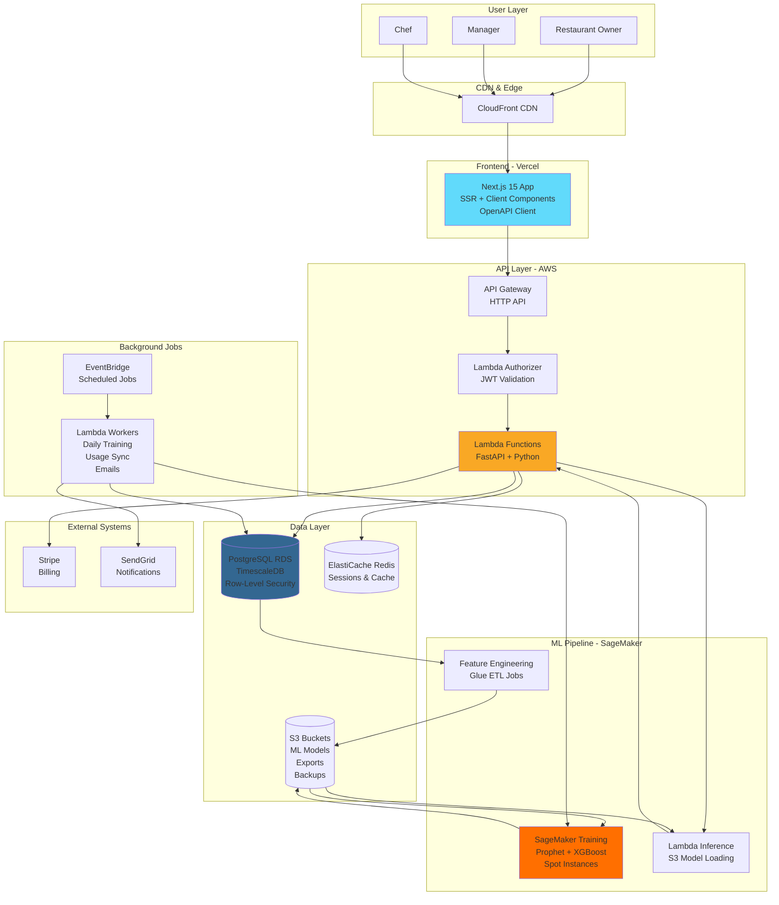

# High Level Overview

> **Part of:** [Flux Architecture Documentation](./README.md)
>
> **Related Sections:**
> - [Data Models](./02-data-models.md)
> - [API Specification](./03-api-specification.md)
> - [Deployment](./10-deployment.md)

---

## Introduction

This document outlines the complete fullstack architecture for Flux, including backend systems, frontend implementation, ML/AI infrastructure, and their integration. It serves as the single source of truth for AI-driven development, ensuring consistency across the entire technology stack.

This unified approach combines what would traditionally be separate backend and frontend architecture documents, streamlining the development process for modern fullstack applications where these concerns are increasingly intertwined.

### Starter Template or Existing Project

**Status**: N/A - Greenfield project

This is a greenfield project with no existing codebase or starter template. All architectural decisions are being made from scratch, optimized specifically for the restaurant SaaS use case with ML forecasting capabilities.

### Change Log

| Date | Version | Description | Author |
|------|---------|-------------|--------|
| 2025-12-17 | 1.0 | Initial architecture document | Winston (Architect) |
| 2025-12-18 | 2.0 | Updated to Python backend (FastAPI, SQLAlchemy, Terraform) | Winston (Architect) |

---

## High Level Architecture

### Technical Summary

Flux is a serverless, multi-tenant SaaS platform built on AWS, leveraging Next.js 15 for the frontend and a Python FastAPI-based Lambda backend. The architecture uses PostgreSQL with Row-Level Security for multi-tenant data isolation and AWS SageMaker for ML model training. For MVP, data is manually uploaded via CSV, with real-time POS data ingestion via Kinesis planned as a post-MVP feature. TimescaleDB extensions optimize time-series query performance. The platform is designed for 10,000 concurrent restaurant customers, achieving sub-second API response times and 99.9% uptime.

**Key Integration Points:**
- **Frontend ↔ Backend**: REST API with OpenAPI schema, auto-generated TypeScript client from Pydantic models
- **Backend ↔ POS Systems (Post-MVP)**: Adapter pattern with provider-specific Python implementations (Toast, Square, etc.)
- **Backend ↔ ML Services**: Celery tasks + SQS trigger SageMaker training; Lambda functions (Python) serve predictions
- **Data Flow (MVP)**: CSV Upload → S3 → Lambda (Python) → PostgreSQL/TimescaleDB → ML Pipeline (Python) → Predictions → Frontend

### Platform and Infrastructure Choice

**Platform:** AWS
**Key Services:** Lambda, API Gateway, RDS PostgreSQL (TimescaleDB), SageMaker, S3, ElastiCache Redis, CloudFront
**Deployment Host and Regions:**
- Primary: eu-west-1 (Ireland) - for EU customers (GDPR compliance)
- Secondary: us-east-1 (N. Virginia) - for US customers
- Frontend CDN: CloudFront (global)

**Rationale:** AWS was selected for its native ML capabilities (SageMaker), cost-effective serverless compute (Lambda), proven scalability for 10K+ tenants, and mature GDPR compliance tooling. SageMaker's spot instance training provides 70% cost savings, while Lambda's per-request pricing optimizes costs for variable load. The eu-west-1 region ensures GDPR data residency requirements are met.

### Repository Structure

**Structure:** Monorepo
**Monorepo Tool:** Turborepo
**Package Organization:** Workspaces pattern with shared packages for types, UI components, and business logic

```
flux/
├── apps/
│   ├── web/                    # Next.js 15 frontend (TypeScript)
│   ├── api/                    # FastAPI backend (Python)
│   └── ml-pipeline/            # ML services (Python + SageMaker)
├── packages/
│   ├── ui/                     # Shared React components (TypeScript)
│   └── config/                 # Shared configs (ESLint, Tailwind)
├── infrastructure/             # Terraform (HCL)
├── docs/
├── turbo.json
└── package.json
```

**Rationale:** Monorepo with Turborepo enables code reuse, atomic changes, and fast builds via remote caching. The Python backend and ML pipeline share dependencies via `uv`. Frontend uses TypeScript for UI, while the backend uses Python for a unified language with the ML stack. POS adapters are organized as Python services within the API app. Terraform manages all AWS infrastructure with a modular approach.

### High Level Architecture Diagram



**Architecture Flow Explanation:**

1.  **User Access**: Restaurant users access the Next.js frontend via CloudFront CDN.
2.  **API Requests**: The frontend uses an auto-generated TypeScript client to make RESTful API calls to API Gateway. A Lambda Authorizer validates the JWT, and the request is routed to the appropriate FastAPI-based Lambda function.
3.  **Data Ingestion (MVP)**: Users upload historical sales data via CSV, which is processed by a Lambda function and ingested into PostgreSQL.
4.  **ML Pipeline**:
    *   EventBridge triggers daily training jobs at 2 AM UTC.
    *   Feature engineering in Python extracts data from RDS → S3.
    *   SageMaker Training runs models on spot instances.
    *   Trained models are stored in S3 for inference.
5.  **Caching**: Redis caches API responses and sessions.
6.  **Background Jobs**: EventBridge schedules tasks for model training, usage sync, and email notifications.

**Key Design Decisions:**

- **CSV Upload for MVP**: Simplifies initial data ingestion without complex POS integrations.
- **Lambda for API**: Cost-effective and scales automatically with demand.
- **SageMaker Spot Instances**: Provides significant cost savings on model training.
- **TimescaleDB**: Enhances query performance for time-series forecasting data.

### Architectural Patterns

- **Serverless Architecture:** Utilizes Lambda for API and background jobs.
- **Multi-Tenant with Row-Level Security (RLS):** Employs shared PostgreSQL with RLS for data isolation.
- **Adapter Pattern (Post-MVP):** Planned for POS integrations.
- **API Gateway Pattern:** Centralizes API management.
- **Event-Driven Architecture:** Uses EventBridge and SQS/Celery for async tasks.
- **Repository Pattern:** Abstracts data access via SQLAlchemy.
- **Feature Flag Pattern:** Manages feature rollouts with AWS AppConfig.

---

## Tech Stack

Refer to the definitive tech stack document at **[./tech-stack.md](./tech-stack.md)**. The summary below highlights the key technologies.

### Technology Stack Table

| Category | Technology | Version | Purpose |
|----------|-----------|---------|---------|
| Frontend Language | TypeScript | 5.3+ | Type-safe frontend development |
| Frontend Framework | Next.js | 15+ (App Router) | React meta-framework with SSR |
| **Backend Language** | **Python** | **3.12+** | **Backend API development** |
| **Backend Framework** | **FastAPI** | **0.109+** | **Modern async API framework** |
| **API Style** | **REST + OpenAPI** | **OpenAPI 3.1**| **HTTP REST API with schema** |
| **Database** | **PostgreSQL (RDS)** | **16+ with TimescaleDB** | **Relational + time-series** |
| **ORM** | **SQLAlchemy** | **2.0+** | **Python ORM with async** |
| **Authentication** | **FastAPI OAuth2 + JWT**| **Latest** | **JWT authentication** |
| **IaC Tool** | **Terraform** | **1.7+** | **Infrastructure as Code** |
| **Logging** | **structlog** | **Latest** | **Structured JSON logging** |
| **Validation** | **Pydantic** | **2.5+** | **Runtime type validation** |
| **DB Migrations** | **Alembic** | **1.13+** | **Database migrations** |

### Impact Mapping: Technology Choices → Team & Operations

#### **Impact on Hiring**

- **Positive:** Unified Python stack for backend and ML attracts data-centric engineers. Modern stack is appealing.
- **Challenges:** Requires developers comfortable with both TypeScript and Python, and specific AWS services.
- **Strategy:** Prioritize strong Python/SQL skills, cloud-native mindset.

#### **Impact on Onboarding**

- **Fast Onboarding:** `uv` for dependency management simplifies setup. OpenAPI and SQLAlchemy models provide clear documentation.
- **Learning Curve:** Next.js Server Components, RLS, and SageMaker require some ramp-up time.
- **Acceleration:** Use dev scripts, ADRs, and pair programming.

#### **Impact on Maintenance**

- **Benefits:** Pydantic and `mypy` for data validation, Turborepo for build caching, Alembic for database migrations.
- **Challenges:** Managing breaking changes in fast-moving tools, AWS service limits.

#### **Team Structure Implications**

- **Optimal Team:** A mix of Full-Stack, Backend/Data, ML, and DevOps engineers.
- **Why it Works:** Enables specialization while allowing cross-functional contributions.

#### **Operational Complexity Score**

| Aspect | Complexity (1-10) | Mitigation |
|--------|-------------------|------------|
| **Local Development** | 4/10 | Docker Compose, mock APIs, seed scripts |
| **CI/CD Pipeline** | 3/10 | GitHub Actions with caching |
| **Monitoring & Debugging**| 5/10 | Datadog unified dashboard |
| **Database Migrations** | 4/10 | Alembic with staging/production flow |
| **ML Model Deployment** | 6/10 | SageMaker Model Registry |
| **Multi-tenant Data Isolation**| 7/10 | Thorough RLS policy testing |
| **POS Integration (Post-MVP)**| 8/10 | Extensive error handling and retries |
| **Cost Management** | 5/10 | AWS Cost Explorer and Budget Alerts |

**Overall Maintenance Philosophy:**
This stack optimizes for developer velocity and data processing power, allowing a lean team to manage a complex, data-intensive product effectively.

---

**Next:** [Data Models →](./02-data-models.md)