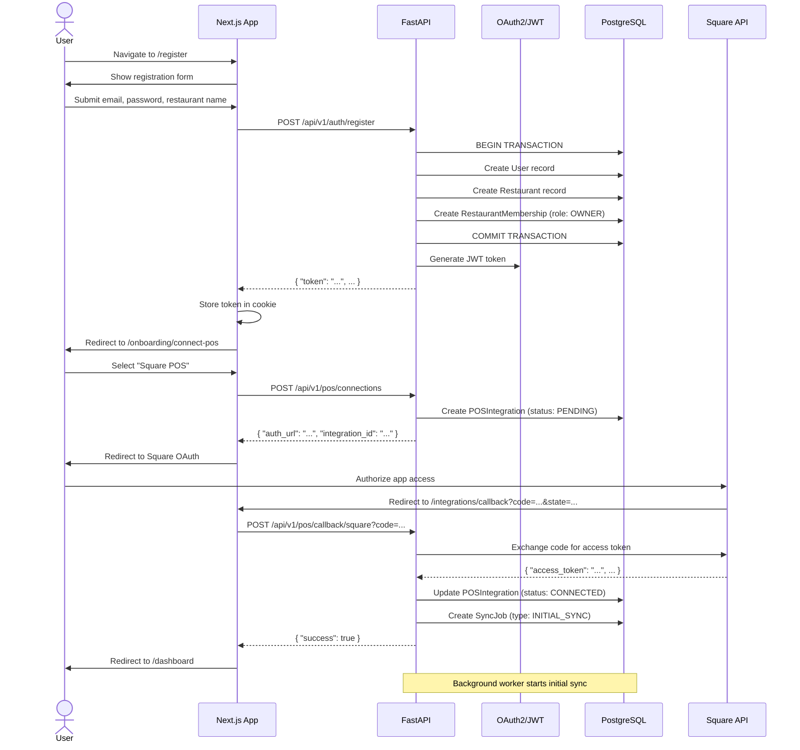
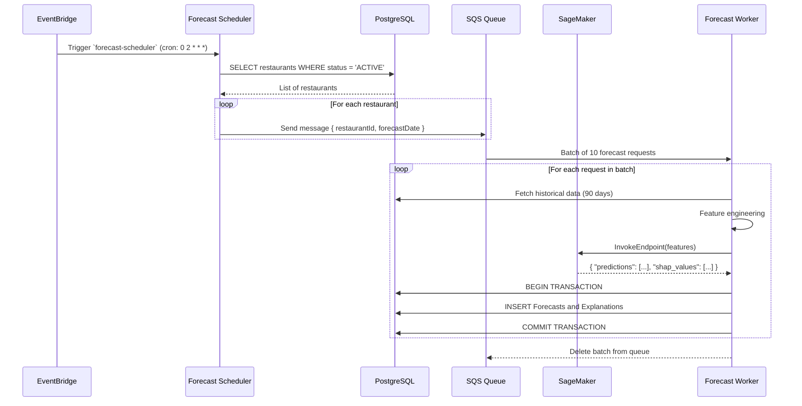
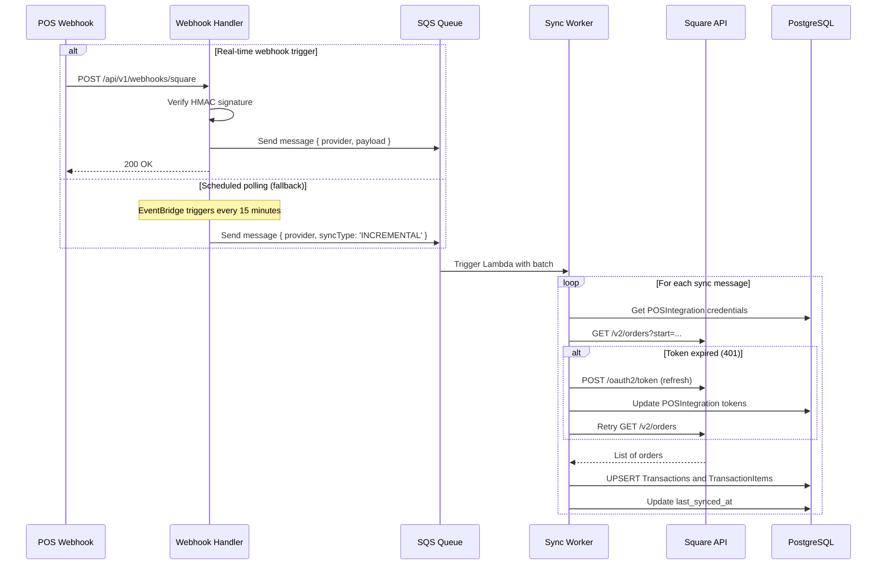
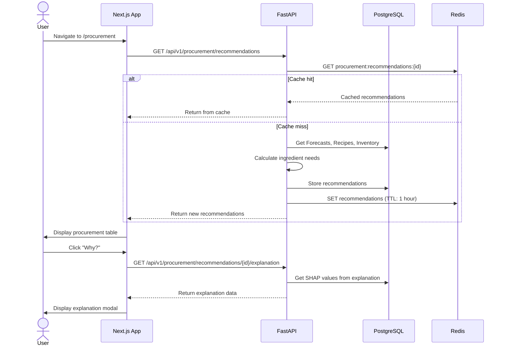
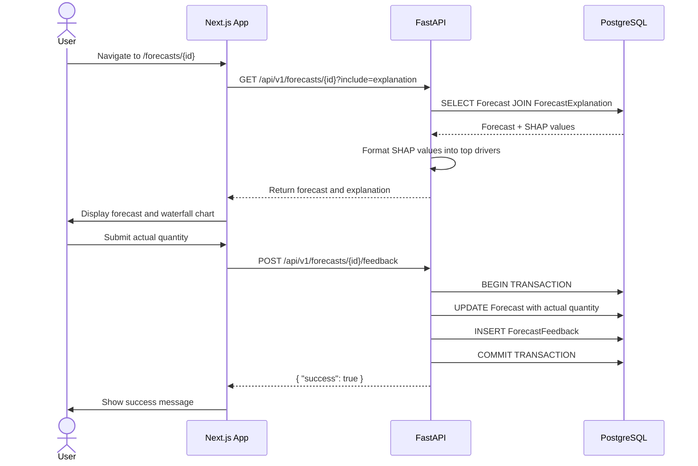
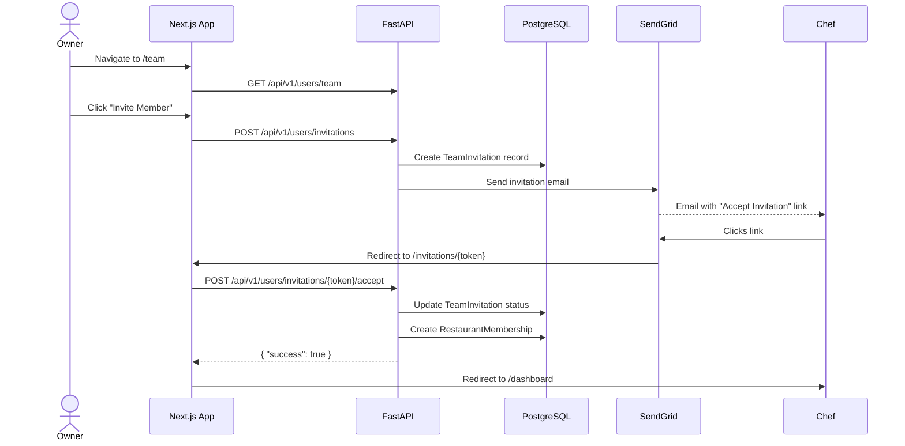
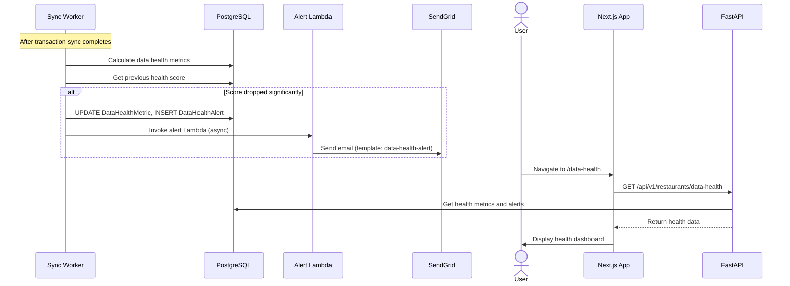

# Core Workflows

> **Part of:** [Flux Architecture Documentation](./README.md)

---

## User Registration & Onboarding

**Description:** New restaurant owner signs up and connects their POS system.

---

## Forecast Generation (Scheduled)

**Description:** Daily automated forecast generation via EventBridge rule.

---

## POS Transaction Sync

**Description:** Background worker syncs transactions from POS systems.

---

## Procurement Recommendation Flow

**Description:** User views AI-powered procurement recommendations.

---

## Forecast Explanation & Feedback

**Description:** User views SHAP explanations for a forecast and submits feedback.

---

## Team Member Invitation

**Description:** Restaurant owner invites a chef to join their team.

---

## Data Health Monitoring

**Description:** System detects data quality issues and alerts users.

