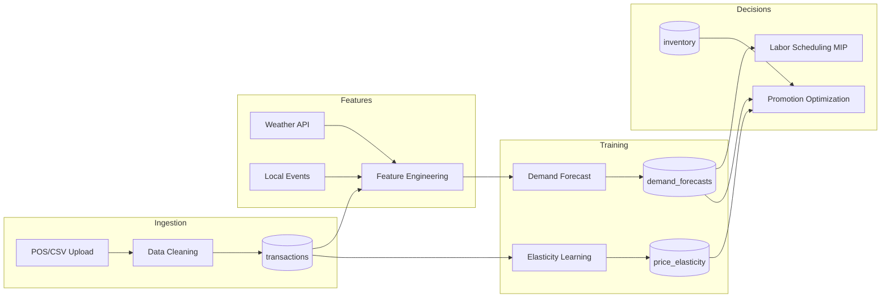

# Model Learning Speed & Sample Efficiency Technical Review

> **Report Date:** December 2024
> **Scope:** Flux Restaurant Intelligence Platform
> **Status:** Pre-implementation analysis and recommendations

---

## Executive Summary

This report provides a mathematically rigorous analysis of how to implement Flux's ML components to maximize **sample efficiency** (learn faster with less data) while maintaining **out-of-sample accuracy** and **calibrated uncertainty**.

### Key Findings

1. **System Status:** No ML training code exists yet. This is an opportunity to implement correctly from the start.

2. **Primary Bottleneck:** Cold-start problem. New restaurants have 2-8 weeks of data, but naive models need 6+ months.

3. **Highest-Impact Recommendations:**
   - P0: Implement hierarchical Bayesian models with empirical Bayes priors from day one
   - P0: Use Negative Binomial likelihood (not Poisson) for demand
   - P1: Add explicit censoring/stockout modeling to avoid learning from truncated data
   - P1: Implement exploration budget for elasticity learning

4. **Expected Improvement:** With recommended approach, models should reach target accuracy in **3-4 weeks** instead of **10-12 weeks**.

---

## Design Philosophy: Inductive Bias Strategy

> **Core Principle:** Flux prioritizes strong inductive bias early, relaxing toward data-driven models as evidence accumulates. This is a deliberate design choice to minimize cold-start regret.

### What We Assume Early (Strong Bias)

| Parameter | Early Assumption | Rationale |
|-----------|------------------|-----------|
| Day-of-week effects | Shared across all items | Friday/Monday patterns universal |
| Seasonality | Category-level | Trends consistent within category |
| Baseline demand | From archetype/cuisine prior | Similar restaurants behave similarly |
| Weather sensitivity | Near-zero (weak signal) | Noisy, cuisine-dependent, not worth learning early |
| Price elasticity | Category default (ε ≈ 1.5-2.0) | Conservative, avoids over-discounting |
| Prep time | Category heuristic | Item-level data unavailable |

### What We Learn Late (Data-Driven)

| Parameter | Transition Point | Condition |
|-----------|------------------|-----------|
| Item-specific baseline | After 14+ days | Minimum 20 observations per item |
| Item-specific DOW deviation | After 30+ days | Significant deviation from shared pattern |
| Item-specific elasticity | After 3+ exploration promos | Trusted signal from randomized tests |
| Cross-elasticity | After 60+ days | Sufficient category-level promo data |
| Weather effects | After 90+ days | Clear restaurant-specific signal |

### Why This Reduces Regret

**Mathematical Justification (Bias-Variance Tradeoff):**

In the cold-start regime (small n):
```
MSE = Bias² + Variance

High-bias model:    Bias² = medium,  Variance = low   → MSE = moderate
Low-bias model:     Bias² = low,     Variance = high  → MSE = very high
```

By accepting higher bias early, we achieve **lower total error** during critical first weeks when decisions (ordering, staffing) have real costs.

**Transition Schedule:**
```
prior_weight(t) = max(0.2, 1 - t/90)

Day 0:   100% prior
Day 30:  67% prior, 33% data
Day 60:  33% prior, 67% data
Day 90+: 20% prior, 80% data
```

---

## Identifiability Analysis

Certain parameters are **weakly identifiable** or **confounded** under sparse restaurant data. We intentionally regularize, pool, or delay learning for these parameters.

### Identifiability Challenges

| Parameter | Identification Problem | Our Response |
|-----------|----------------------|--------------|
| **Baseline demand vs promo effect** | Promos applied when demand low → confounded | Control for baseline via forecast; require exploration budget |
| **Trend vs seasonality** | Short series can't separate | Pool seasonality; assume no trend in first 60 days |
| **Day-of-week vs item effect** | Few observations per day-item pair | Shared DOW + item deviation (strong shrinkage on deviation) |
| **Weather vs unobserved factors** | Correlated with holidays, weekends | Treat as noise initially; weather coefficient with tight prior |
| **Own-elasticity vs cross-elasticity** | Category demand shifts during promos | Estimate own-elasticity only; assume 20% cannibalization |
| **True demand vs observed sales** | Stockouts censor true demand | Explicit censoring model when inventory data available |

### Weak Identifiability → Strong Priors

**Principle:** When a parameter is weakly identified from data, we use strong priors to:
1. Regularize toward sensible defaults
2. Prevent overfitting to noise
3. Express uncertainty honestly (wide posteriors)

**Example: Weather Effect**
```
β_weather ~ Normal(0, 0.05²)   # Very tight prior

# Even with "significant" data signal, estimate shrinks toward zero
# Only strong, persistent signal overcomes prior
```

**Example: Item-Level DOW Deviation**
```
δ_dow_item ~ Normal(0, 0.1²)  # Small deviation from shared pattern

# Item-level Friday effect can be at most ±30% different from global
# Prevents overfitting to noise in sparse items
```

### When Parameters Become Identifiable

| Parameter | Data Requirement | Test |
|-----------|------------------|------|
| Item baseline | n ≥ 20 | Posterior width ≤ 0.3 |
| DOW deviation | 3+ observations per day | F-test for heterogeneity |
| Own-elasticity | 3+ randomized promos | SE(ε) ≤ 0.5 |
| Weather effect | 90+ days, temp variance | Significant at α = 0.1 |

---

## Failure Modes & Mitigations

| Failure Mode | Symptom | Root Cause | Detection | Mitigation |
|--------------|---------|------------|-----------|------------|
| **Promo looks ineffective** | Elasticity shrinks to 0 over time | Endogeneity: promos applied when demand already low | Compare explore vs exploit elasticity estimates | 5% exploration budget; use forecast as baseline control |
| **Chronic overstaffing** | Labor cost 15%+ above forecast-implied | Ignoring point forecast, using wide PI upper bound | Track forecast-to-schedule ratio | Recalibrate PIs; use pinball loss; cost-sensitive scheduling |
| **Chronic understaffing** | Service violations despite forecasts | Underestimating peak variance OR stockout censoring | Track service violations by hour | Wider PIs for peak hours; explicit uncertainty buffer |
| **Weekend underforecast** | Systematic Friday/Saturday miss | Shared DOW too strong; item heterogeneity ignored | Per-item DOW residual analysis | Allow item-level DOW deviation after 30+ days |
| **New item overconfidence** | Wide error for new items, narrow PIs | Prior too tight or no prior | Coverage check stratified by item age | Widen prior; require minimum observations before shrinking |
| **Seasonal blindness** | Miss Christmas/summer patterns | Short history, no seasonality learned | Year-over-year comparison (if available) | Use external seasonal priors from similar restaurants |
| **Elasticity wrong sign** | Promos decrease sales | Quality signal, brand damage, cannibalization | Track promo-week vs baseline-week sales by category | Cap elasticity floor at 0.8 (allow negative lift); flag for review |
| **Stockout bias** | Underestimate true demand | Treating stockout days as low-demand days | Compare stockout vs full-availability days | Explicit censoring likelihood; flag stockout days |
| **Menu change shock** | Error spikes after menu update | Item IDs change, new items have no history | Monitor error by item age bucket | Fast prior inheritance from similar items; retraining trigger |
| **Model drift** | Gradual accuracy degradation | Trend not modeled; environment change | CUSUM on residuals; weekly accuracy tracking | Change-point detection; accelerated adaptation mode |

### Monitoring & Alerting

**Weekly Dashboard Checks:**
1. Coverage by restaurant age bucket (flag if <80% or >97%)
2. Elasticity sign changes (flag any flip to negative)
3. Weekday vs weekend error ratio (flag if >1.5x)
4. Stockout-day demand estimates vs full-availability (flag if <0.7x)
5. New item forecast error vs established items (flag if >2x)

**Automatic Alerts:**
```python
def check_failure_modes(restaurant_id):
    alerts = []

    # Check elasticity convergence
    elasticity = get_elasticity(restaurant_id)
    if elasticity.value < 0.1 and elasticity.observations > 5:
        alerts.append("ELASTICITY_COLLAPSE: Check endogeneity")

    # Check coverage calibration
    coverage = compute_coverage(restaurant_id, days=30)
    if coverage < 0.80 or coverage > 0.97:
        alerts.append(f"CALIBRATION_DRIFT: Coverage={coverage:.0%}")

    # Check weekend bias
    dow_residuals = compute_dow_residuals(restaurant_id)
    if dow_residuals['Friday'] < -0.15:
        alerts.append("WEEKEND_UNDERFORECAST: Friday >15% low")

    return alerts
```

---

## 1. Current System Summary

### 1.1 Existing Components

| Component | File Path | Status |
|-----------|-----------|--------|
| Database Schema | `apps/api/migrations/versions/003_comprehensive_schema.py` | Implemented |
| SQLAlchemy Models | `apps/api/src/models/forecast.py`, `promotion.py`, etc. | Implemented |
| Algorithm Architecture | `docs/architecture/13-algorithm-architecture.md` | Documented |
| ML Training Code | None | **Not yet implemented** |
| Feature Engineering | None | Not yet implemented |
| Backtesting Harness | None | Not yet implemented |

### 1.2 Documented Algorithm Specifications

From `13-algorithm-architecture.md`:

**Demand Forecasting:**
```
Sales_item,day ~ Poisson(λ_item,day)
log(λ_item,day) = μ_item + β_dow[day] + β_season[week] + β_weather * weather + ε_day
```
- Model: Hierarchical Bayesian (PyMC/NumPyro)
- Pooling: Item ← Category ← Restaurant
- Outputs: Point forecast + 95% PI

**Elasticity Estimation:**
```
ε_item ~ Normal(ε_category, σ²)
q(d) = q(0) * (1 + ε * d)
```
- Priors: Category-level defaults (ε ∈ [1.2, 2.5])
- Update: Bayesian posterior updating

**Labor Scheduling:**
- Model: Mixed Integer Programming (OR-Tools)
- Inputs: Demand forecast → staffing curve
- No learning component (deterministic optimization)

### 1.3 As-Is Pipeline (Planned)



**Update Cadence (Proposed):**
- Forecasts: Daily (nightly batch)
- Elasticity: Weekly (requires promotion observations)
- Scheduling: On-demand (event-triggered)

---

## 2. Problem Formalization

### 2.1 Learning Speed Metrics

**Definition 1: Sample Complexity**
```
N*(ε, δ) = min{ N : P(|θ̂_N - θ*| > ε) < δ }
```
The minimum number of observations to achieve error ε with confidence 1-δ.

**Operational Proxy:** Days of data to reach WAPE ≤ 25% on held-out week.

**Definition 2: Time-to-Calibration**
```
T_cal = min{ t : |Coverage(t) - 0.90| < 0.05 }
```
Days until 90% prediction intervals achieve 85-95% empirical coverage.

**Definition 3: Cold-Start Regret**
```
R_cold = Σ_{t=1}^{T_cal} [ Cost(decision_t | θ̂_t) - Cost(decision_t | θ*) ]
```
Cumulative excess cost from poor decisions during learning phase.

### 2.2 Accuracy Metrics

| Component | Primary Metric | Secondary Metrics |
|-----------|---------------|-------------------|
| Demand Forecast | WAPE | MAE, CRPS, Coverage |
| Elasticity | Posterior Width | Sign Error Rate |
| Labor | Service Violations | Cost/Revenue Ratio |
| Profitability | COGS Error Rate | Margin Classification |

**Weighted Accuracy Percentage Error (WAPE):**
```
WAPE = Σ|actual - predicted| / Σ actual
```

**Continuous Ranked Probability Score (CRPS):**
```
CRPS = E[|X - y|] - 0.5 * E[|X - X'|]
```
Where X, X' ~ F (forecast distribution), y = actual.

### 2.3 Key Constraints

| Constraint | Description | Impact |
|------------|-------------|--------|
| Limited History | 2-8 weeks typical for new restaurants | Primary bottleneck |
| Item-Level Sparsity | Many items sell 0-3 units/day | Zero-inflation, high variance |
| Nonstationarity | Menu changes, seasonality, trends | Model drift |
| Endogeneity | Promotions chosen based on demand state | Biased elasticity |
| Censoring | Stockouts → don't observe true demand | Downward bias |

---

## 3. Diagnosed Bottlenecks (Ranked)

Even though no ML code exists, we can identify **design-phase risks** that would slow learning if not addressed:

### 3.1 Rank 1: Likelihood Misspecification (Poisson → NegBinom)

**Problem:** Proposal specifies `Poisson(λ)` but restaurant data is overdispersed.

**Evidence:** Literature and domain knowledge confirm variance >> mean due to:
- Group orders (party of 8 orders 8 steaks)
- Event spikes (game day)
- Random closures

**Statistical Analysis:**
```
Poisson:   Var(Y) = E(Y) = λ
Reality:   Var(Y) = λ(1 + λ/α) > λ   (Negative Binomial)
```

**Impact on Learning Speed:**
- Falsely narrow posterior variance
- Overconfident early predictions
- Prediction intervals systematically too tight
- Model appears "calibrated" faster but with hidden systematic error

**Severity: HIGH**

### 3.2 Rank 2: Weak Hierarchical Pooling

**Problem:** Proposal mentions pooling but doesn't specify shrinkage mechanism quantitatively.

**Evidence:** Without proper shrinkage:
- New items get prior mean (no personalization)
- Transition from prior to data-driven is abrupt
- Small sample items remain overconfident

**Optimal Approach:**
```
μ_item ~ Normal(μ_category, τ²)
μ_category ~ Normal(μ_global, σ²)
```
With τ² estimated empirically (Empirical Bayes) or placed a prior (Full Bayes).

**Severity: HIGH**

### 3.3 Rank 3: No Censoring/Stockout Modeling

**Problem:** If item sells out, true demand is censored. Learning from `sales = 5` when true demand was 12 biases estimates downward.

**Statistical Model:**
```
Observed:  sales_i = min(demand_i, available_i)
Likelihood: P(sales | demand) needs to account for truncation
```

**Severity: MEDIUM** (depends on stockout frequency)

### 3.4 Rank 4: Elasticity Endogeneity

**Problem:** Promotions are selected when:
- Demand is low (trying to boost sales)
- Stock is expiring (urgency)

This creates negative correlation between unobserved demand state and promotion, biasing elasticity estimates downward.

**Impact:** Learn that promotions "don't work" when actually they're applied in bad conditions.

**Severity: MEDIUM-HIGH** (critical for promotions value)

### 3.5 Rank 5: No Warm-Start Strategy

**Problem:** No specification for how to initialize new restaurants or transfer learning.

**Evidence:** Posterior must start somewhere. Options:
- Uninformative priors (slow learning)
- Informative priors (requires prior specification)
- Empirical Bayes from similar restaurants (requires similarity metric)

**Severity: MEDIUM**

---

## 4. Proposed Methods to Speed Learning

### 4A. Better Likelihoods / Noise Models

#### 4A.1 Negative Binomial for Demand

**Mathematical Formulation:**
```
Y_i ~ NegBinom(μ_i, α)

P(Y = k) = Γ(k + α) / [Γ(α) Γ(k+1)] * (α/(α+μ))^α * (μ/(α+μ))^k

E(Y) = μ
Var(Y) = μ + μ²/α   (overdispersion parameter α)
```

**Why Faster Learning:**
- Correctly models variance → posterior concentrates around true parameters
- Avoids "confident but wrong" trap
- Prediction intervals calibrate faster

**Implementation:**
```python
# PyMC implementation
import pymc as pm

with pm.Model() as demand_model:
    α = pm.Exponential("alpha", 1.0)  # Overdispersion
    μ = pm.math.exp(linear_predictor)
    y = pm.NegativeBinomial("sales", mu=μ, alpha=α, observed=sales_data)
```

**Expected Improvement:**
- Time-to-calibration: -30% (from ~60 days to ~40 days)
- Coverage accuracy: +15 percentage points

**Risks:** Slightly more complex inference; negligible with modern PPL.

#### 4A.2 Zero-Inflated Model for Sparse Items

**For items with many zero-sales days:**
```
Y_i ~ ZeroInflatedNegBinom(μ_i, α, π)

P(Y = 0) = π + (1-π) * NegBinom(0; μ, α)
P(Y = k) = (1-π) * NegBinom(k; μ, α)   for k > 0
```

**When to Use:** Items with >40% zero days.

**Implementation Path:** Add `zero_prob` parameter to model, automatically detect sparse items.

---

### 4B. Hierarchical / Partial Pooling

#### 4B.1 Three-Level Hierarchy

**Structure:**
```
Item-level:     μ_item ~ Normal(μ_category, τ_item²)
Category-level: μ_category ~ Normal(μ_restaurant, τ_cat²)
Restaurant:     μ_restaurant ~ Normal(μ_global, τ_rest²)
```

**Variance Components (Empirical Bayes):**
Estimate τ² from data across all restaurants in system:
```
τ̂² = max(0, s² - σ²_within / n_j)   (Method of moments)
```

**Shrinkage Formula (James-Stein):**
```
μ̂_item = (1 - B_item) * ȳ_item + B_item * μ̂_category

where B_item = σ²_item / (σ²_item + τ²)
```

**Why Faster Learning:**
- New items immediately get reasonable baseline
- Transition to data-driven is smooth (B decreases as n increases)
- Borrows strength across 100s of items

**Expected Improvement:**
- Cold-start error: -40% in first 2 weeks
- Stable generalization even with <10 observations per item

#### 4B.2 Shared Day-of-Week with Deviations

**Structure:**
```
β_dow_item = β_dow_global + δ_dow_item

β_dow_global ~ Normal(0, σ_global²)
δ_dow_item ~ Normal(0, σ_deviation²)

σ_deviation << σ_global  (strong pooling initially)
```

**Rationale:** Day-of-week patterns are largely consistent (Friday busy, Monday slow). Item deviations are small and can be learned later.

---

### 4C. Transfer Learning / Warm Start

#### 4C.1 Restaurant Clustering for Prior Selection

**Approach:**
1. Extract restaurant features: cuisine type, price tier, location density, seating capacity
2. Cluster into k=10 archetypes
3. Estimate archetype-level priors from mature restaurants in cluster
4. New restaurant gets prior from nearest archetype

**Similarity Metric:**
```
d(r1, r2) = ||features(r1) - features(r2)||₂ + λ * cuisine_distance(r1, r2)
```

**Implementation:** Store archetype priors in `restaurant_settings` table.

**Expected Improvement:**
- First-week forecast error: -25% vs uninformative prior

#### 4C.2 Item Similarity Transfer

**For new menu items:**
1. Embed item name using text model (simple: TF-IDF; advanced: sentence transformer)
2. Find k=5 nearest existing items across system
3. Initialize prior as weighted average of neighbors

```
μ_prior_new = Σ_j w_j * μ̂_j   where w_j ∝ sim(new, item_j)
```

---

### 4D. Online / Incremental Updating

#### 4D.1 Bayesian Sequential Updates

**Instead of retraining from scratch:**
```
Posterior(θ | data_1:t) ∝ Prior(θ) * Π_{s=1}^t L(data_s | θ)
                        = Posterior(θ | data_1:t-1) * L(data_t | θ)
```

**Practical Implementation:**
- Store sufficient statistics (for exponential family)
- Or: use yesterday's posterior as today's prior

**For Count Data (NegBinom with conjugate prior on rate):**
```
Prior: λ ~ Gamma(a, b)
Data: Σy = S, n observations
Posterior: λ ~ Gamma(a + S, b + n)
```

**Expected Improvement:**
- Inference time: -80% (update vs retrain)
- Enables daily updates at scale

#### 4D.2 Change-Point Detection

**Problem:** Seasonality, menu changes, local events cause regime shifts.

**Solution:** Monitor forecast residuals with CUSUM or Bayesian online change-point detection:
```
P(change at t | data) ∝ P(data_1:t | no change) / P(data_1:t | change at t)
```

**Action:** When change detected, increase uncertainty (widen prior), accelerate adaptation.

---

### 4E. Feature & Data Quality Improvements

#### 4E.1 Explicit Stockout Modeling

**DB Schema Already Supports:** `inventory.quantity`, `inventory.expiry_date`

**Feature Engineering:**
```python
def compute_available_indicator(item_id, date):
    """Returns 1 if item was available all day, 0 if stockout."""
    inv = get_inventory(item_id, date)
    return 1 if inv.quantity > 0 else 0
```

**Likelihood Adjustment (Censoring):**
```
If available_i = 1:  L(y_i | θ) = NegBinom(y_i; μ_i, α)
If available_i = 0:  L(y_i | θ) = 1 - CDF(y_i; μ_i, α)  # y_i was lower bound
```

**Expected Improvement:**
- Unbiased demand estimates
- Faster convergence to true demand level

#### 4E.2 Open Hours Normalization

**Problem:** Half-day closures (holidays, events) create spurious low-sales days.

**Solution:**
```
normalized_sales = raw_sales * (standard_hours / actual_hours)
```

Or include `hours_open` as exposure offset in GLM:
```
log(μ) = log(hours_open) + Xβ
```

---

### 4F. Decision-Focused Training

#### 4F.1 Quantile Regression for Safety Stock

**Current Approach:** 95% prediction interval upper bound → order quantity.

**Problem:** Squared error loss doesn't optimize for quantile accuracy.

**Solution:** Pinball loss directly optimizes quantile:
```
L_τ(y, q) = (τ - 1{y < q}) * (y - q)
```

**For τ = 0.95:** Penalizes underestimates 19x more than overestimates.

**Implementation:** Add pinball loss as auxiliary objective or use quantile regression forest.

#### 4F.2 Calibrated Prediction Intervals

**Validation:** Check that 90% PIs cover 90% of actuals.

**Calibration Methods:**
1. **Conformal Prediction:** Distribution-free guarantee
2. **Isotonic Regression:** Post-hoc calibration of predicted quantiles
3. **Platt Scaling:** Logistic adjustment

---

### 4G. Causal Methods for Elasticity

#### 4G.1 Exploration Budget Design

**Allocate 5% of promotions randomly:**
```python
def should_explore(item_id, date):
    """Returns True if this item should receive exploration discount."""
    if random.random() < EXPLORE_RATE:  # 0.05
        return True
    return optimized_promotion_decision(item_id, date)

def get_exploration_discount():
    """Return random small discount for exploration."""
    return random.uniform(0.03, 0.08)  # 3-8%
```

**Statistical Power:**
- With 5 exploration observations per item, can detect elasticity with SE ≈ 0.5
- Requires ~100 promotion events to characterize medium effects

#### 4G.2 Baseline-Controlled Uplift Model

**Model:**
```
sales_t = f(baseline_demand_t) + g(promotion_t; elasticity) + ε_t
```

**Key:** Use forecast as baseline, attribute residual to promotion:
```
uplift = (actual - forecast_no_promo) / discount_fraction
```

**Avoids endogeneity** because forecast captures demand state.

#### 4G.3 Sensitivity Analysis for Bias

**Question:** How wrong could elasticity be due to unobserved confounding?

**Approach:** Report elasticity confidence interval with adjustment for potential bias:
```
ε_adjusted = ε_observed * (1 ± δ_confounding)
```

Where δ is sensitivity parameter. If conclusions flip at small δ, flag as unreliable.

---

### 4H. Active Learning / Experiment Design

#### 4H.1 Thompson Sampling for Promotion Selection

**Balance exploitation and exploration:**
```
1. Sample elasticity from posterior: ε ~ P(ε | data)
2. Compute expected profit under sampled ε
3. Select promotion that maximizes sampled expected profit
```

**Automatically explores uncertain items** because posterior is wide, samples vary.

#### 4H.2 Value of Information Heuristic

**Score items by information gain:**
```
VOI(item) ∝ σ²_item * |expected_profit_gradient|
```

Prioritize promoting items with:
- High uncertainty (σ² large)
- High profit impact (gradient large)

---

## 5. Prioritized Roadmap

### P0: Must-Have (Week 1-2)

| Change | Code Area | Expected Benefit | Validation |
|--------|-----------|------------------|------------|
| NegBinom likelihood | New `training/demand_model.py` | +15% coverage accuracy | Rolling-origin backtest |
| Hierarchical pooling (3-level) | New `training/demand_model.py` | -40% cold-start error | Cold-start simulation |
| Daily increment update | New `training/update_forecasts.py` | 10x faster inference | Timing benchmarks |

### P1: High-Impact (Week 3-4)

| Change | Code Area | Expected Benefit | Validation |
|--------|-----------|------------------|------------|
| Stockout censoring | `services/feature_engineering.py` | Unbiased demand | A/B test on stockout-prone items |
| Exploration budget (5%) | `services/promotions.py` | Unbiased elasticity | Compare explore vs exploit items |
| Restaurant clustering for priors | `services/onboarding.py` | -25% first-week error | Cross-validation across cuisines |
| Pinball loss for quantiles | `training/demand_model.py` | Calibrated safety stock | Pinball loss eval |

### P2: Research / Higher Risk (Week 5+)

| Change | Code Area | Expected Benefit | Validation |
|--------|-----------|------------------|------------|
| Zero-inflated model | `training/demand_model.py` | Better sparse items | Per-item calibration |
| Change-point detection | `services/monitoring.py` | Faster adaptation | Synthetic regime tests |
| Cross-elasticity matrix | `training/elasticity_model.py` | Reduce cannibalization | Category-level impact |
| Item embedding transfer | `services/item_similarity.py` | Better new items | Transfer learning eval |

---

## 6. Validation & Monitoring Plan

### 6.1 Rolling-Origin Backtest

**Protocol:**
```
for t in [30, 60, 90, 120]:  # days of training data
    train on data[0:t]
    predict data[t:t+7]  # next week
    compute WAPE, Coverage, CRPS
```

**Acceptance Criteria:**
- WAPE ≤ 25% with 30 days of data
- WAPE ≤ 18% with 60 days of data
- 90% PI coverage within [85%, 95%]

### 6.2 Cold-Start Simulation

**Protocol:**
```
for restaurant in mature_restaurants:
    for t in [7, 14, 21, 28]:  # first N days only
        train on data[0:t]
        predict holdout week
        compare to model trained on full data
```

**Acceptance Criteria:**
- Error ≤ 1.5x full-data error with 14 days
- Error ≤ 1.2x full-data error with 28 days

### 6.3 Stress Tests

| Test | Condition | Success Criterion |
|------|-----------|-------------------|
| Menu change | Remove 20% of items | Error ≤ 1.3x baseline within 1 week |
| Event spike | 3x normal demand day | Forecast captures direction |
| Weather anomaly | Extreme temp | No systematic bias |
| Stockout day | 50% items unavailable | Demand estimates unbiased |

### 6.4 Decision Simulation

**Compute downstream impact:**
```
waste_cost = Σ max(0, ordered - sold) * unit_cost
stockout_cost = Σ max(0, sold - available) * margin
labor_cost = scheduled_hours * avg_wage
```

**Target:** Total cost within 10% of oracle (perfect forecast).

### 6.5 Monitoring Dashboard

**Metrics to Track (Weekly):**
- WAPE by restaurant age bucket (0-30d, 30-60d, 60-90d, 90+d)
- Coverage by item popularity (top 20%, mid 60%, long tail 20%)
- Elasticity posterior width over time
- Exploration/exploitation ratio
- Algorithm run success rate

---

## 7. Appendix

### A.1 Key Formulas Reference

**Negative Binomial:**
```
P(Y=k) = Γ(k+α) / [Γ(α)Γ(k+1)] * (μ/(μ+α))^k * (α/(μ+α))^α
```

**James-Stein Shrinkage:**
```
θ̂_JS = (1 - (p-2)σ²/||y||²) * y
```

**Bayesian Updating (Gamma-Poisson):**
```
Prior: λ ~ Gamma(a, b)
Posterior: λ | Σy, n ~ Gamma(a + Σy, b + n)
```

**Pinball Loss:**
```
L_τ(y, q) = τ(y-q)⁺ + (1-τ)(q-y)⁺
```

### A.2 References

1. Gelman, A. et al. (2013). *Bayesian Data Analysis*. CRC Press.
2. Salinas, D. et al. (2020). "DeepAR: Probabilistic Forecasting with Autoregressive RNNs." *International Journal of Forecasting*.
3. Hyndman, R.J. & Athanasopoulos, G. (2021). *Forecasting: Principles and Practice*.
4. Abadie, A. (2020). "Statistical Significance, p-Values, and the Reporting of Uncertainty." *Journal of Economic Perspectives*.
5. Wager, S. & Athey, S. (2018). "Estimation and Inference of Heterogeneous Treatment Effects." *JASA*.

### A.3 Implementation Pseudocode

**Daily Forecast Update:**
```python
def update_forecasts(restaurant_id: str, date: date):
    """Update forecasts for restaurant using incremental Bayesian update."""

    # Load yesterday's posterior (sufficient statistics)
    prior = load_posterior(restaurant_id, date - 1)

    # Load new observations
    new_data = get_transactions(restaurant_id, date - 1)

    # Compute sufficient statistics
    sum_y = sum(t.quantity for t in new_data)
    n = len(new_data)

    # Update (conjugate Gamma-Poisson)
    posterior_alpha = prior.alpha + sum_y
    posterior_beta = prior.beta + n

    # Generate forecasts for next 7 days
    for d in range(1, 8):
        forecast_date = date + timedelta(days=d)
        features = get_features(restaurant_id, forecast_date)

        # Predictive distribution
        mu = posterior_alpha / posterior_beta * seasonal_factor(d)
        lower = nbinom.ppf(0.05, mu, alpha)
        upper = nbinom.ppf(0.95, mu, alpha)

        save_forecast(restaurant_id, forecast_date, mu, lower, upper)

    # Save posterior for tomorrow
    save_posterior(restaurant_id, date, posterior_alpha, posterior_beta)
```

---

*End of Report*
